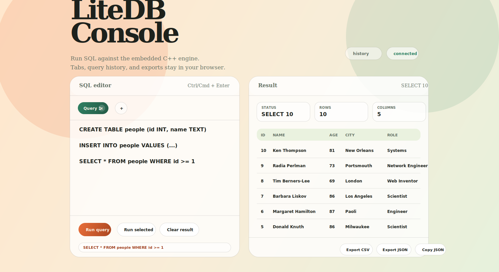
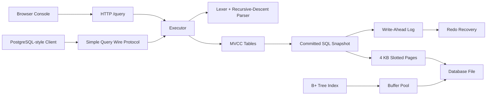

# LiteDB

**A from-scratch C++17 relational database with real storage internals, MVCC transactions, WAL recovery, a PostgreSQL-style wire endpoint, and a polished browser SQL console.**



LiteDB is an embedded relational database engine built as a learning project, but it is intentionally more than a toy parser around a map. It includes the pieces that make databases interesting: 4 KB slotted pages, a disk manager, a buffer pool, a B+ tree, write-ahead logging, crash recovery, MVCC version chains, a SQL parser/executor, and a browser interface for running queries.

The standout idea is simple: **database internals you can inspect, test, and use through a real UI.** Most small database projects stop at command-line demos. LiteDB ships with a local browser console that feels like a miniature developer tool: saved query tabs, query history, result metrics, CSV/JSON export, copy JSON, and a durable database file underneath.

## Why It Stands Out

- **Built from the storage layer up**: pages, buffer pool, WAL, MVCC, parser, executor, and server are all implemented in the repo.
- **Browser-first developer experience**: run SQL from `http://127.0.0.1:8080/` without installing a GUI client.
- **Durable SQL state**: committed SQL-visible state is persisted into database pages and protected by WAL redo.
- **Real transaction semantics**: MVCC prevents dirty reads, supports snapshot isolation, rolls back aborted writes, and detects stale writer conflicts.
- **PostgreSQL-style access path**: the server implements enough of the PostgreSQL v3 simple-query flow to act like a small database service.
- **Tested internals**: page durability, B+ tree scale, WAL recovery, MVCC isolation, SQL validation, and persistent restart behavior are covered by GoogleTest.

## Feature Overview

| Area | What LiteDB Does |
| --- | --- |
| Page storage | Fixed-size 4 KB slotted pages with headers, slot directories, tuple insertion, reads, and tombstones |
| Disk manager | `pread`/`pwrite` page I/O against a single database file |
| Buffer pool | Fixed-size page cache with pin counts, dirty tracking, free list, and LRU eviction |
| B+ tree | Persistent page-backed index for `int64_t` keys to `uint64_t` values, including splits and range scans |
| WAL | Append-only transaction records and page after-images |
| Recovery | Redo committed writes only when the WAL LSN is newer than the page on disk |
| MVCC | Row version chains, snapshot reads, commit/abort cleanup, stale write conflict handling |
| SQL | `CREATE`, `INSERT`, `SELECT`, `UPDATE`, `DELETE`, `BEGIN`, `COMMIT`, `ROLLBACK` |
| Browser UI | Query tabs, history, result metrics, table rendering, CSV/JSON export, copy JSON |
| Server | Local TCP server with PostgreSQL-style startup/auth/simple-query responses |

## Quick Start

Install dependencies:

```bash
sudo apt-get install -y cmake g++ libgtest-dev
```

Build and test:

```bash
mkdir -p build
cd build
cmake .. -DCMAKE_BUILD_TYPE=Debug
cmake --build . -j$(nproc)
ctest --output-on-failure
```

Run LiteDB:

```bash
./litedb [postgres_port] [database_path] [browser_port]
```

Defaults:

```text
postgres_port = 5432
database_path = litedb.db
browser_port  = 8080
```

Example using non-default local ports:

```bash
./build/litedb 15432 ./demo.db 18080
```

Open the browser console:

```text
http://127.0.0.1:18080/
```

## Try These Queries

Run each statement one at a time in the browser UI:

```sql
CREATE TABLE users (id INT, name TEXT, age INT, city TEXT, role TEXT)
```

```sql
INSERT INTO users VALUES (1, 'Ada Lovelace', 36, 'London', 'Mathematician'), (2, 'Grace Hopper', 85, 'New York', 'Computer Scientist'), (3, 'Alan Turing', 41, 'Manchester', 'Cryptanalyst'), (4, 'Katherine Johnson', 101, 'White Sulphur Springs', 'NASA Mathematician'), (5, 'Donald Knuth', 86, 'Milwaukee', 'Computer Scientist'), (6, 'Margaret Hamilton', 87, 'Paoli', 'Software Engineer'), (7, 'Barbara Liskov', 86, 'Los Angeles', 'Computer Scientist'), (8, 'Tim Berners-Lee', 69, 'London', 'Web Inventor'), (9, 'Radia Perlman', 73, 'Portsmouth', 'Network Engineer'), (10, 'Ken Thompson', 81, 'New Orleans', 'Systems Programmer')
```

```sql
UPDATE users SET role = 'Programming Pioneer' WHERE age >= 80
```

```sql
SELECT * FROM users
```

## Browser Console

The browser UI is served directly by the C++ binary. There is no frontend build step, no Node server, and no external asset pipeline. The HTML, CSS, and JavaScript are embedded in `src/server/web_server.cpp`.

What the UI gives you:

- **Multiple saved query tabs**: each tab keeps its own SQL and result panel.
- **Rename and close tabs**: double-click a tab name to rename it; close tabs you no longer need.
- **Query history**: every run is saved in `localStorage` with timestamp, status, and row count.
- **Click-to-load history**: selecting a history entry restores the SQL into the active editor.
- **Run selected SQL**: highlight part of the editor and run only that snippet.
- **Result dashboard**: every result shows command status, row count, and column count.
- **Export CSV/JSON**: result rows can be downloaded immediately.
- **Copy JSON**: copy rows to the clipboard for quick debugging or sharing.
- **Durable backend**: browser queries run through the same executor and database file as the server.

Browser queries are auto-commit. Explicit `BEGIN`, `COMMIT`, and `ROLLBACK` are available through the PostgreSQL-style port.

## How LiteDB Works



### 1. SQL Enters Through the UI or TCP Server

The browser console sends SQL to `POST /query`. The TCP server accepts PostgreSQL-style startup messages and simple-query packets. Both routes call the same executor, so the UI and server operate on the same database state.

### 2. The Parser Builds a Statement

LiteDB uses a hand-written lexer and recursive-descent parser. The parser supports table creation, inserts, selects, updates, deletes, transaction commands, comparisons, boolean operators, and simple arithmetic expressions.

Supported SQL shape:

```sql
CREATE TABLE name (col INT|TEXT [PRIMARY KEY], ...)
INSERT INTO name VALUES (...)
SELECT *|cols FROM name [WHERE expr]
UPDATE name SET col = expr [, ...] [WHERE expr]
DELETE FROM name [WHERE expr]
BEGIN
COMMIT
ROLLBACK
```

### 3. The Executor Validates and Runs the Statement

The executor checks table existence, column names, value counts, type compatibility, and write conflicts. It evaluates expressions and routes reads/writes into MVCC table storage.

In in-memory mode, this is useful for fast tests. In durable mode, commits persist the SQL-visible state into pages and log those page images through WAL.

### 4. MVCC Provides Transactional Visibility

Each row has a version chain. New versions are not visible to other transactions until commit. Readers see a stable snapshot based on their begin timestamp. Aborted versions are removed, and stale writers cannot overwrite newer committed versions.

This protects against:

- Dirty reads
- Lost writes from stale transactions
- Aborted inserts becoming visible
- Updates hiding committed versions before commit

### 5. WAL Protects Durable State

LiteDB writes redo records containing page after-images. On restart, recovery scans the WAL, finds committed transactions, and replays only writes whose LSN is newer than the page already on disk.

This means committed SQL state can be restored even if the database file is missing an applied page image but the WAL still contains the committed record.

### 6. Pages, Disk, and Buffer Pool Form the Storage Foundation

The low-level storage stack uses:

- `Page`: a fixed 4 KB slotted page
- `DiskManager`: page reads/writes by page id
- `BufferPool`: cached pages with pin/unpin semantics and LRU eviction
- `BTree`: page-backed ordered index with split support

The SQL executor currently persists committed SQL-visible state as WAL-protected page snapshots. The B+ tree is implemented and tested as a storage component; deeper row/index integration is a natural next step.

## Architecture Map

```text
src/
  storage/
    page.*          4 KB slotted page
    disk_manager.*  page-granular file I/O
    buffer_pool.*   page cache, pinning, dirty flushing, LRU
    btree.*         persistent B+ tree index

  wal/
    wal_manager.*   append-only log records
    recovery.*      committed redo replay

  concurrency/
    transaction.*   transaction ids and timestamps
    mvcc.*          version chains and snapshot visibility

  parser/
    lexer.*         SQL tokenization
    parser.*        recursive-descent parser
    ast.h           statement and expression model

  executor/
    executor.*      SQL validation, expression evaluation, MVCC routing, persistence

  server/
    tcp_server.*    PostgreSQL-style simple-query server
    pg_protocol.*   backend protocol message builders
    web_server.*    browser SQL console and HTTP /query endpoint
```

## Test Coverage

Run:

```bash
ctest --output-on-failure
```

The suite covers:

- Page insert/read/delete behavior
- 1,000-page durability across reopen
- Buffer pool pinning, dirty writes, and LRU eviction
- B+ tree duplicate overwrite, range scan, and 100,000-key random lookup workload
- WAL readback and committed redo recovery
- Recovery skipping already-applied pages
- MVCC snapshot isolation, dirty-read prevention, abort cleanup, and stale writer detection
- SQL parser coverage for create/insert/select/update/delete
- Executor validation for bad column counts, bad types, unknown columns, and write conflicts
- Persistent SQL database restart and WAL-only recovery

## Current Status

| Phase | Component | Status |
| --- | --- | --- |
| 1 | Page manager + buffer pool | Implemented |
| 2 | B+ tree index | Implemented |
| 3 | Write-ahead log + crash recovery | Implemented |
| 4 | MVCC concurrency control | Implemented |
| 5 | SQL parser + query executor | Implemented |
| 6 | PostgreSQL wire protocol | Implemented |
| 7 | Browser SQL console | Implemented |

## Design Notes and Tradeoffs

LiteDB is built to make database internals understandable. That means the implementation favors clear, inspectable components over production-grade completeness.

Important limitations:

- SQL support is intentionally small.
- The browser UI executes statements in auto-commit mode.
- The PostgreSQL protocol implementation supports the simple-query path, not the full extended protocol.
- Durable SQL state is snapshot-based today; full tuple-level table storage and index-backed query planning are future work.
- There is no authentication, permissions model, or network hardening.

These tradeoffs are deliberate for now: LiteDB is a compact, readable database engine that demonstrates the full stack without hiding the interesting parts behind dependencies.

## Roadmap Ideas

- Table storage backed directly by heap pages instead of committed snapshots
- Primary-key indexes wired into SQL execution through the B+ tree
- Query planner and execution nodes
- More SQL types and operators
- Joins and aggregation
- Better PostgreSQL client compatibility
- Optional authentication for the browser and wire server
- Benchmarks against SQLite for small educational workloads

## Project Personality

LiteDB is a database you can learn from and actually touch. It is small enough to read, layered enough to teach real internals, and polished enough to demo in a browser. The goal is not to out-feature PostgreSQL or SQLite. The goal is to make the invisible machinery of a database visible, testable, and fun to explore.
